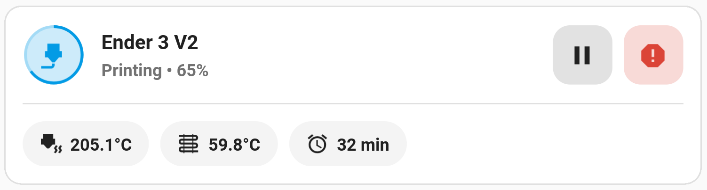
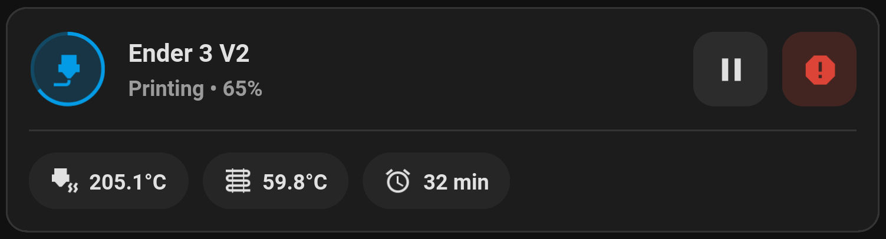

# Threedy

Heavily inspired by [Mushroom](https://github.com/piitaya/lovelace-mushroom). V2 of Threedy aims to simplify things by dividing functionality into separate cards. This not only allows for more customization for the end user, but ease in development and ensuring a lack of bugs.

# FAQ

### Q: Where have you been?

**A:** I've been busy with both university and work. My printer also died in 2021 -- I only just got back into 3D printing this year. 
